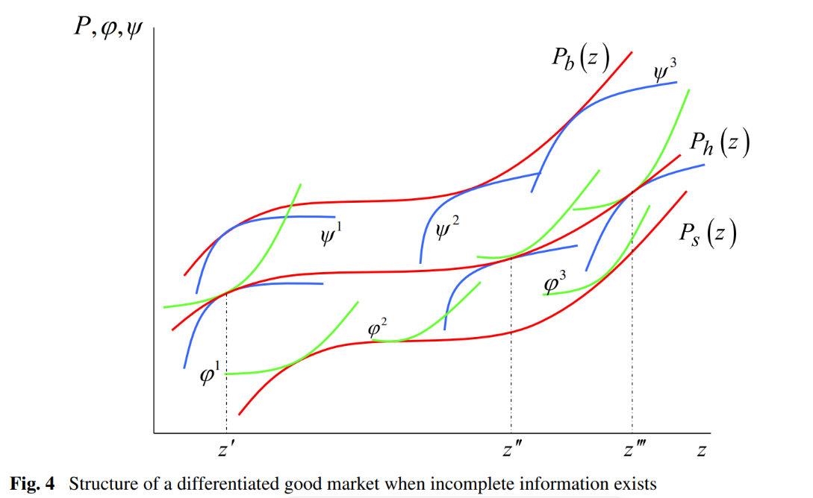

# Résumés Papiers de Recherche

## <u>Liste des articles</u>

- [Résumés Papiers de Recherche](#résumés-papiers-de-recherche)
  - [Liste des articles](#liste-des-articles)
  - [TODO List](#todo-list)
  - [`Running Shoes in Spain`: *Arrrondo et Al*](#running-shoes-in-spain-arrrondo-et-al)
    - [Hypothèses](#hypothèses)
    - [Modèle](#modèle)
    - [Confirmation Hypothèses](#confirmation-hypothèses)
  - [`Hedonic wine price functions with different price`](#hedonic-wine-price-functions-with-different-price)
  - [`A New Approach To Consumer Theory`: *Kevin Lancaster*](#a-new-approach-to-consumer-theory-kevin-lancaster)
    - [Hypothèses](#hypothèses-1)
  - [`Hedonic Housing Prices and the demand for clean air`: *Harrison et Rubinfeld*](#hedonic-housing-prices-and-the-demand-for-clean-air-harrison-et-rubinfeld)
  - [`Stochastic Frontier Analysis using STATA BOOK`: *Kumbhakar*](#stochastic-frontier-analysis-using-stata-book-kumbhakar)
  - [`Hedonic Housing Prices and the Demand for Clean Air`: *David Harrison \& Daniel L. Rubinfled*](#hedonic-housing-prices-and-the-demand-for-clean-air-david-harrison--daniel-l-rubinfled)
    - [1. Le modèle de procédure](#1-le-modèle-de-procédure)
    - [2. Equation de la valeur immobilière](#2-equation-de-la-valeur-immobilière)
    - [3. Equation de la disposition à payer](#3-equation-de-la-disposition-à-payer)
    - [4. Ex : WTP pour les contrôles fédéraux des émissions automobiles](#4-ex--wtp-pour-les-contrôles-fédéraux-des-émissions-automobiles)
    - [5. Conclusion](#5-conclusion)
    - [Hypothèses de distribution paramétrique](#hypothèses-de-distribution-paramétrique)
      - [Distribution Half-Normale](#distribution-half-normale)
      - [Distribution Normale Tronquée](#distribution-normale-tronquée)
  - [`Estimation of hedonic price functions with incomplete information`: *Kumbhakar et Parmeter*](#estimation-of-hedonic-price-functions-with-incomplete-information-kumbhakar-et-parmeter)
    - [Résultats du modèle](#résultats-du-modèle)
    - [Détails calculatoires](#détails-calculatoires)
      - [Full information :](#full-information-)
      - [Incomplete information :](#incomplete-information-)
    - [Modèle Hédonique avec information incomplète](#modèle-hédonique-avec-information-incomplète)
    - [The two-tier frontier method](#the-two-tier-frontier-method)
    - [Conclusion](#conclusion)
  - [`Hedonic Prices and Implicit Markets - Product Differentiation in Pure Competition`: *Rosen*](#hedonic-prices-and-implicit-markets---product-differentiation-in-pure-competition-rosen)
    - [La décision de consommer](#la-décision-de-consommer)
    - [Conclusion](#conclusion-1)

## TODO List

- [ ] Hedonic Pricing Rosen à lire et résumer : `Corentin`
- [ ] The demand for clean air à lire et résumer : `Aybuke`
- [x] Hedonic price functions with incomplete info à lire et résumer : `Corentin`
- [ ] Voir Article Aigner & Al (1977)
## `Running Shoes in Spain`: *Arrrondo et Al*

But de l'article : **déterminer les composantes principales des prix des sneakers en Espagne**

*Innovation* : Utilisation d'un modèle SFA & de pricing Hedonic $\Rightarrow$ possibilité d'inclure la notion de produit innefficient (trop cher). Cette méthodologie peut être appliquée dans d'autres axes 

- Produit = décomposition en bundle d'attributs ~ cf `Kevin Lancaster`

- Les vendeurs combinent un grand nombre d'attributs dans leurs biens pour pouvoir se différencier des entreprises concurrentes. Le but est que les acheteurs se focalisent sur ces attributs pour faire le choix de leur produit préféré.

- Les sneakers sont des biens hautement différenciés : elles se vendent à des prix qui varient selon une marge très vaste.

- La méthode de pricing hédonique estime que la différence de prix des sneakers est due à ses caractéristiques.

- En estimant l'efficacité des produits, le papier pointe les produits overprice pour prédire le montant des réductions à leur accorder afin d'atteindre la frontière compétitive pour ces produits.

- Les sneakers sont des `biens d'expérience` dont la qualité et la correspondance aux attentes ne peut être évaluée qu'après leur utilisation. Dès lors, pour effectuer un choix rationnel, les consos s'orientent vers des recommandations d'amateurs & experts sur des caractéristiques comme : *response*, *stability*, *duration* et *flexibility*.

### Hypothèses

1. Les réductions de prix seront d'autant plus grandes que les produits sont inefficaces selon le modèle, toutes choses égales par ailleurs, indépendamment de la marque.

2. Les évaluations des experts sont positivement corrélées avec l'efficacité des produits.

### Modèle

$$Log(Pik)=\alpha_k+\beta X_{ik}+e_{ik}$$

- $\alpha_k=$ Effet de la marque $k$ sur le prix du produit (*dummies*)
- $\beta=$ Vecteur des coefficients associés aux attributs du produit
- $X_{ik}=$ Vecteur des attributs d'un produit d'une marque $k$
- $e_{ik}=$ Erreur aléatoire

> Dans ce modèle de base, on ne peut pas déterminer si des produits sont overprice (innefficients) !

**Prise en compte de la frontière stochastique:**

- Erreur composite $\epsilon_{ik}= \{u_{ik} + v_{ik}\}$  avec $v_{ik}$ normalement distribué et $u_{ik}$

- $u_{ik}$ sont distribués indépendamment de $v_{ik}$

> L'index d'efficacité d'un produit est $\theta_{ik} = e^{-u_{ik}} \in (0,1]$

- Un $u_{ik}$ grand signifie que le prix fixé est très au dessus de la frontière optimale, dès lors, le produit sera d'autant plus inefficace et l'index proche de 0. Un $u_{ik}$ proche ou $=0$ indique que le produit est proche de la frontière optimale de pricing.

***

**Index d'efficacité** selon les marques des chaussures.

- Index d'efficacité moyen toutes sneakers confondues = 0.85 donc les sneakers sont 15% overprice en moyenne.

| Brand                 | Average |
| --------------------- | ------- |
| Adidas ($n=$ 28)      | 0.832   |
| Asics ($n=$ 35)       | 0.864   |
| Saucony ($n=$ 15)     | 0.875   |
| Nike ($n=$ 25)        | 0.824   |
| Brooks ($n=$ 16)      | 0.860   |
| Mizuno ($n=$ 29)      | 0.858   |
| New Balance ($n=$ 18) | 0.848   |
| Reebok ($n=$ 5)       | 0.859   |

|                 | Coefficient | t       |
| --------------- | ----------- | ------- |
| Lightness       | 0.007       | 0.24    |
| Cushioning      | 0.064       | 2.54**  |
| Flexibility     | 0.058       | 2.17**  |
| Response        | 0.050       | 1.65*   |
| Stability       | 0.070       | 2.74*** |
| Grip            | -0.045      | -1.59   |
| `Brand dummies` |             |         |
| Adidas          | 2.697       | 6.71*** |
| Asics           | 2.679       | 6.88*** |
| Saucony         | 2.779       | 6.89*** |
| Nike            | 2.714       | 6.43*** |
| Brooks          | 2.834       | 7.01*** |
| Mizuno          | 2.524       | 6.36*** |
| New Balance     | 2.544       | 6.21*** |
| Reebok          | 2.522       | 6.26*** |

- Toutes les caractéristiques ne sont pas significatives dans la régression, par exemple : Grip & Lightness n'influent pas sur le prix car les coefficients associés ne sont pas statistiquement significatifs.

- De manière plus intéressante, les dummies de marques sont elles toutes significatives au seuil de 1%, et ce sont elles qui "drivent" le prix dans une importance beaucoup plus grande que les caractéristiques associés aux chaussures.

### Confirmation Hypothèses

- Confirmation $H_1$ : Relation inverse entre l'efficacité du produit et la réduction de prix. La réduction de prix est donc d'autant plus grande que la sneakers est overprice !

- Le modèle permet une bonne prédiction des réductions de prix pour rendre compétitifs les sneakers overprice !

## `Hedonic wine price functions with different price`

Relation entre les prix proposés sur le marché et les **RRP**

**RRP** = Recommended Retail Price

## `A New Approach To Consumer Theory`: *Kevin Lancaster*

**But du modèle proposé : remplacer l'approche traditionnelle par une approche pratique et plus proche du comportement des consommateurs**

- **L'approche traditionnelle de la théorie du consommateur en microéconomie** : les consommateurs préfèrent certains biens et ces préférences vont permettre de construire leur fonction d'utilité $u(x)$ qu'ils vont chercher à maximiser. Dans ce cas, les biens sont consommés parce qu'ils procurent de l'utilité. 
  - *Exemple* : Un ordinateur peut fournir de l'utilité à un conso, quand un autre peut lui préférer une voiture.

- **Nouvelle approche** : Cette fois, ce ne sont pas les biens eux-mêmes qui procurent de l'utilité, mais les caractéristiques des biens. Les biens sont des *inputs* et ce sont les caractéristiques de ces biens qui sont des *outputs*. En général, même uun bien "seul" possède plus d'une caractéristique.
  - *Exemple* : Ce n'est pas le fait de posséder un ordinateur qui procure de l'utilité à un consommateur, mais le fait de pouvoir naviguer sur internet, programmer, jouer, etc.

- L'ajout d'un nouveau bien dans ce modèle est très simple : si un nouveau bien possède des caractéristiques dans les mêmes niveaux de proportions qu'un ancien bien, alors : 
  
    $\Rightarrow$ A) Il ne sera pas vendu si son prix est trop cher. 

    $\Rightarrow$ B) Il remplacera l'ancien bien si son prix est suffisamment compétitif.

### Hypothèses

1. Le bien par lui même ne donne pas d'utilité au consommateur; il possède des caractéristiques et ce sont celles-ci qui procurent de l'utilité.
2. Un bien possède plus d'une caractéristique, et la plupart des caractéristiques seront partagées par un ou plusieurs biens.
3. Une combinaison de biens peut posséder des caractéristiques différentes que des biens consommés séparément. *Exemple* : Achat d'un costume complet ou seulement d'un pantalon de costume.

## `Hedonic Housing Prices and the demand for clean air`: *Harrison et Rubinfeld*

**WTP** : Le prix maximum qu'un consommateur est prêt à payer pour un bien. Si les consos sont probablement prêts à payer moins que cette frontière, ils ne sont pas prêts à payer plus.

## `Stochastic Frontier Analysis using STATA BOOK`: *Kumbhakar*

- L'**efficacité technique** peut soit être modélisée comme *output-orientée* ou *input-orientée*
- On se concentre sur l'efficacité technique output-orientée

Dans ce cas, un modèle de frontière de production stochastique avec efficacité technique output-orientée peut s'écrire :

> $(1)$ - $\text{ln } y_i = \text{ln }y_i^*-u_i, \text{ } u_i\geq0$ 

> $(2)$ - avec $\text{ln }y_i^* = f(x_i;\beta) + v_i$

- $i$ sont ici les observations (entreprises, individus,etc.)
- $y_i=$ output observé
- $y_i^*=$ output maximum
- $x_i= J\times 1$ vecteur des inputs variables
- $\beta= J\times 1$ vecteur des coefficients associés aux input variables
- $v_i=$ est une erreur aléatoire $\Rightarrow$ variation inexpliquée par les variables indépendantes du modèle $-$ cette erreur n'a pas de biais et peut être positive comme négative d'où le $E(v_i)=0$, la valeur attendue de ces erreurs sur un grand nombre d'observations est donc égal à 0.
- $u_i=$ innefficacité productive $\geq$ 0 $\Leftrightarrow u_i = \ln y_i^* - \ln y_i$ $-$ *en réarrangeant l'équation $(1)$*. $u_i$ correspond donc à la log-différence entre l'output réel et l'output maximum. **Dès lors, $u_i \times 100 \%$ donne le pourcentage d'output perdu à cause de l'innefficacité technique.**

L'équation $(2)$ définit la fonction de la frontière stochastique de production. Étant donné $x$, la frontière donne le niveau de production maximum possible et est stochastique à cause de $v_i \Rightarrow$ 
« stochastique » fait référence à l'inclusion du caractère aléatoire ou de la variabilité non observée dans le modèle pour tenir compte de facteurs qui affectent la production ou la rentabilité mais qui ne sont pas directement observables.

- Puisque $u_i \geq 0$, l'output observé $y_i$ est limité en dessous du niveau de production frontière $y_i^*$

> Etant donné l'équation $(1)$ et $(2)$, on peut ré-écrire le modèle de cette façon :

$$
\begin{cases}
\ln y_i = \ln y_i^* - u_i\\
\ln y_i^* = f(x_i, \beta) + v_i
\end{cases}
$$

- On substitue alors $\ln y_i^*$ dans l'équation $(1)$ et on trouve :

$$\ln y_i = f(x_i, \beta) - u_i + v_i$$
$$\ln y_i = f(x_i, \beta) + \epsilon_i$$

- Avec le terme d'erreur composé $\epsilon_i = v_i - u_i$

> En réarrangeant l'équation $(1)$ :

$$
\ln y_i = \ln y_i^* - u_i\\
\Leftrightarrow \ln y_i - \ln y_i^* = -u_i\\
\Leftrightarrow \ln \left(\frac{y_i}{y_i^*}\right)= -u_i\\
\Leftrightarrow \exp \ln \left(\frac{y_i}{y_i^*}\right)= \exp(-u_i)\\
\Leftrightarrow  \frac{y_i}{y_i^*}= \exp(-u_i)\\
\Leftrightarrow \boxed{\exp(-u_i) = \frac{y_i}{y_i^*}}\\
$$

- On voit ici que $\exp(-u_i)$ donne le ratio d'output produit sur l'output maximum possible. Le ratio se réfère à l'efficacité technique de la firme $i$.

## `Hedonic Housing Prices and the Demand for Clean Air`: *David Harrison & Daniel L. Rubinfled*

**But de l'article** : Examiner comment les données du marché immobilier peuvent être utilisées pour évaluer la disposition à payer des consommateurs pour une meilleure qualité de l'air. **Avec l'utilisation de la régression hédonique des prix, on voit que les dommages marginaux dus à la pollution de l'air augmentent avec le niveau de pollution de l'air et le revenu des ménages.** 

*Les résultats sont sensibles à la spécification de l'équation des prix immobiliers, mais insensibles à celle de l'équation de la demande de qualité de l'air.*

**Hypothèses :**
- évaluer le coût sociétal supplémentaire de la pollution
- analyser le marché immobilier pour estimer la volonté de payer pour une meilleure qualité de l'air. 

$\rightarrow$ Modèle en 4 étapes.

On part du principe que les personnes paieront davantage pour un logement situé dans une zone où la qualité de l'air est bonne que pour un logement identique situé dans une zone où la qualité de l'air est médiocre.

### 1. Le modèle de procédure

Modèle **pour mesurer la disposition à payer des consommateurs pour des améliorations de la qualité de l'air**. 

$\rightarrow$ Modèle suppose que les ménages prennent en compte le niveau de pollution de l'air, la quantité et la qualité du logement et d'autres caractéristiques de quartier pour faire leur choix. Les différences de valeur des logements sont utilisées pour estimer la disposition à payer des ménages pour des réductions de la concentration de polluants atmosphériques.

Le modèle repose sur une fonction d'utilité maximisée par les ménages sous contrainte budgétaire et prend en compte la quantité de biens privés (=1), les attributs du logement (y compris la pollution de l'air), le revenu et les coûts de transport.

Le modèle se "décompose" en plusieurs étapes : 

1. **Spécifier la fonction de la valeur hédonique du logement**, *p(h)* : elle traduit les attributs du logement en prix, et suppose que les consommateurs perçoivent avec précision ces attributs et que le marché est en équilibre à CT.

2. **Calcul de la disposition à payer pour une variation marginale de la pollution de l'air** : à l'équilibre, la disposition à payer annuelle du ménage pour une légère amélioration de la qualité de l'air est égal à l'augmentation du coût lié à l'achat d'une autre maison aux caractéristiques identiques, à l'exception d'une amélioration marginale de la qualité de l'air.

 Pour déterminer : la relation entre le niveau de pollution de l'air et la disposition à payer maginale :

3. **Estimation de la fonction de disposition à payer** : Fonction estimée en régressant les évaluations marginales des ménages (étape 2) sur la concentration de la pollution de l'air et d'autres variables comme le revenu du ménage qui pourraient influencer la demande d'air + propres.

4. **Evaluer les avantages en dollars de l'amélioration de la qualité de l'air** : consiste à utiliser la fonction de disposition à payer pour attribuer une vzleur aux améliorations physiques de la qualité de l'air qui sont estimées à l'aide d'un modèle météorologique.

### 2. Equation de la valeur immobilière

*Données de la zone statistique métropolitaine standard de Boston en 1970, marché des propriétaires.*

La **variable dépendante** de l'équation de logement est la **valeur médiane des logements occupés par les propriétaires dans la zone de recensement**. 

Les **variblaes indépendantes** se composent des **attributs structurels, de quartier, des variables d'accessibilité et une variable pour la pollution de l'air**.

$\rightarrow$ La variable de pollution utilisée est la concentration d'oxydes d'azote ($NOX$).

Utilisation de la fonction **semi-log** car elle offre un meilleur ajustement. 

La variable $NOX$ est non-linéaire $\rightarrow$ introduction de $NOX^p$ avec *p* paramètre inconnue (ici $p=2$). Son coefficient est négatif -> **une augmentation de la pollution de l'air entraine une baisse de la valeur immobilière**.

Lorsque $NOX$ est les autres variables prennent leur valeur moyenne, le changement des valeurs médianes des logementss baisse de 1613$ pour chq variation d'un pphm de $NOX$.

Même équation estimée avec $PART$ au lieu de $NOX$, les coeff sont les mêmes $\rightarrow$ les coeff des variables non liées à la pollution sont pratiquement les mêmes avec $PART$ ou $NOX$.

Hétéroscédasticité : l'exposant 2 pour p n'est pas fiable, correction avec MCO pondéré en ajoutant $log(NOX)$ et $log(NOX)²$, et une autre équation avec $NOX$ et $NOX²$. Coeff similaire à ceux de l'équation de base. Pour corriger l'hétéroscédasticité, utilisation de la méthode des moindres carrés pondérés. 

Spécification des variables non polluantes : Sppression des variables d'accessibilité a réduit l'impact mesuré de la concentration de NOX sur les valeurs immobilières.

### 3. Equation de la disposition à payer

En calculant la dériéve de l'équation de la valeur du logement par rapport à NOX (2e étape), on obtient des info sur le montant que les ménages seraient prêts à payer pour des faibles réductions des niveaux de pollution de l'air. 

5 formulations d'équation de WTP, dont 2 qui supposent une relation linéaire entre WTP pour une modification marginale de la concentration de NOW ett le niveau de NOX, le revenu des lénages et le nb de personnes par unité d'habitation; les 3 autres relation log-log.

> Les résultats montrent que la WTP pour une amélioration marginale de la concentration de NOX est positive pour tous les niveaux de revenu et augmente à mesure que les niveaux de NOX augmentent.

> Un ménage à revenu moyen serait prêt à payer env 800$ pour une réduction de 1 pphm de NOX lorsque le niveau de NOX est de 3 pphm, et 2200$ lorsque le niveau de NOW atteint 9 pphm. 

> Les ménages + aisés sont prêts à payer davantage pour les niveaux de NOX + élevés (700$ de + pour NOX = 0 pphm)

**Elasticité de WTP** : on teste l'hypothèses que les ménages ont des élasticités de WTP différentes par rapport aux niveaux de NOX. **Les ménages à faible revenu ont une élasticité plus élevée** $\rightarrow$  la valorisation marginale des améliorations de la qualité de l'air diminue + rapidement pour les ménages à faible revenu lorsque la pollution de l'air diminue, que pour les ménages à revenu  moyen et élevé.

### 4. Ex : WTP pour les contrôles fédéraux des émissions automobiles

-> Avantages de la valeur immobilière associés à un programme de contrôle des émissions automobiles visant à améliorer la qualité de l'air dans la région de Boston. 

La valeur moyenne en $ des améliorations physiques de la concentration de NOX dépend du montant que chq ménage est prêt à payer pour l'amélioration physique qu'il vit.

Variation des avantages en fonction des différentes équations de WTP et de valeur immoiblière prises en compte. 

> Equation linéaire de valeur linéaire : donne une estimation des avantages moyens + élevée ($118$$ par ménage).

> Equation semi-log de la valeur immobilière et l'équation log-log de WTP: lorsque $p=2$ pour $NOX^p$, l'estimation des avantages est de $83$$ par ménage et par an. 
 $\rightarrow$ l'éq° prend en compte le WTP pour des réductions marginales de la pollution peut varier en f° de la concentration de pollution et du revenu des ménages. 

 **/!\ L'équation semi-log est l'éq° à laquelle on accorde le + de confiance.**

**Sensibilité de p** : on voit que p a un impact significatif sur les avantages moyens en modifiant la valeur de p entre 1 et 3 : 
- lorsque $p=1$ au lieu de $2$, les avantages moyens augmentent de $22\%$ (passent à $101$$).
- lorsque $p=3$, les avantages moyens baissent de $29\%$ (passent à $59$$). 

> Pour $p=2$, on a une erreur standard de $1.3$, $\rightarrow$ conclusion : la vraie valeur des avantages moyens pourrait varier d'env $60$$ par an à + de $100$$ par an en f° de la spécification de $NOX$. 

**Test de sensibilité de l'éq° WTP** : les résultats montrent que le choix d'une f° WTP spécifique n'influence pas vraiment les avantages moyens (avec l'éq° linéaire on passe de $83$$ à $84$$).

On continue à faire des tests pour explorer la sensibilité des avnatages moyens avec des éq° de valeurs immobilières différentes, et l'éq° WTP log-log (avec NOX et INC) : 

- suppression des variables d'accessibilité ($DIS$ et $RAD$) : les avantages moyens sont passés de $83$ à $47$$. Certains avantages d'une + grande accessibilité annulent les inconvénient d'une augmentation de NOX. Donc les avantages d'une réduction de NOX semblent moindres.
- suppression de $LSTAT$, variable (population avec CSP le plus bas) : augmentation de $83$ à $105$$.

> Ces résultats montrent que les avantages d'une réduction de la concentration de la pollution atmosphérique peuvent être **sous-estimés ou sur-estimés** si l'éq° utilisée pour décrire la structure du marché du logement est mal spécifiée.
> /!\ faire attention aux éq° avec des variables omises qui peuvent être fortement corrélées avec la pollution de l'air.

- Modifier l'éq° de la valeur immobilière pour y ajouter une relation non-linéaire de NOX : inclut NOX et NOX² baisse les avantages ($83$ à $79$$), ou avec $logNOX$ et $logNOX²$ où l'on passe à $65$$. => montre sensibilité des avantages mesurés.

- Sous-marchés : la présence de sous-marché peut avoir un impact important sur les avantages moyens. La création de sous-marché en f° du revenu, de l'accessibilité à l'emploi et du statut socio-économique peut entrainer une baisse importante des avantages moyens ($83$ à $49$$).
- Correction de l'hétéroscédasticité : a un effet très faible sur les résultats (baisse à $76$$).

### 5. Conclusion

La plupart des études qui tentent de mesurer la WTP pour de l'air pur en f° des différences de valeur de logement  estiment une éq° hédonique dans laquelle les valeures immobilières sont régressées contre les niveaux de pollution et d'autres attributs immobiliers. Mais ils supposent souvent que la valeur attribuée à une amélioration marginale de la concentration de la pollution de l'air est indépendante du niveau de pollution de l'air, du revenu des ménages et des préférences des ménages => revient à dire que les dommages de pollution sont identiques pour tous les ménages. 

L'estimation en 4 étapes permet de tenir compte de la variation de la WTP en f° du niveau de pollution de l'air et du revenu des ménages. Les résultats montrent que  les dommages marginaux dus à la pollution augmentent avec le niveau de pollution de l'air et avec le niveau de revenu des ménages. Cependant, l'utilisation incorrecte des estimations de la valorisation marginale pour calculer les avantages des améliorations non marginale entraine **une surestimation** des avantages de 30%.

L'étude souligne égalemnt la sensibilité des estimations des avantages à la spécification de l'équation de valeur immobilière. Selon la façon dont cette relation est modélisée, les estimations des avantages peuvent varier jusqu'à 60 %. En revanche, les résultats montrent que la spécification de la fonction de volonté de payer a peu d'impact sur les estimations des avantages.

### Hypothèses de distribution paramétrique

**Voir page 59 du livre !** 

Les procédures statistiques paramétriques se fondent sur des hypothèses sur la forme de la distribution
(i.e., une distribution normale ou hal-normale) dans la population sous-jacente et aussi sur la forme des paramètres (i.e., moyennes & écarts-types) de la distribution.

#### Distribution Half-Normale

#### Distribution Normale Tronquée

## `Estimation of hedonic price functions with incomplete information`: *Kumbhakar et Parmeter*

**Dispersion en prix** : Certains acheteurs trouvent des prix bas grâce à des méthodes de recherche et d'acquisition d'information, tandis que des vendeurs font payer des prix plus élévés en obtenant des informations sur ces mêmes potentiels acheteurs.

> *But du papier* : Développer un modèle de prix hédonique qui incorpore les effets de l'info incomplète sur les deux côtés du marché (**buyer/seller**) $\Rightarrow$ pour obtenir des estimations des écarts entre les prix du marché et la disposition à payer maximale (WTP) des acheteurs et la volonté minimale des vendeurs d’accepter (WTA).

- Le papier a été réalisé sur l'American Housing SUvrey (AHS). On trouve que l'information incomplète a un impact important sur les prix de l'immobilier.

- Dans la littérature hédonique, l'unicité des biens devient de moins en moins une raison expliquant la dispersion en prix quand plus de caracteristiques sont prises en compte. L'ignorance (manque d'information) devient le facteur principal causant les variations de prix. Whatever its cause, price dispersion
can be taken as an empirical regularity

- **Situation actuelle** : Existence de canaux d'information grâce auxquels les acheteurs et les vendeurs peuvent obtenir des informations; les petites annonces, Internet, les cookies récupérés sur les utilisateurs en sont quelques exemples. 

- Bien qu'il n'existe aucun moyen de connaître la WTP la plus élevée ou la WTA la plus basse sans publicité explicite de ces prix, les vendeurs et les acheteurs peuvent obtenir des informations grâce à de la recherche. Toutefois, des *search costs* existent et donc
les acteurs du marché ne seront jamais entièrement informés DONC des variations de prix
dus au manque d'info existeront même après avoir contrôlé les caractéristiques du produit !

- Nouvelle terminologie : les acheteurs et les vendeurs qui manquent d’informations complètes sont appelés `déficients`.
Contrairement à l'ignorance, le terme déficient signifie que les acheteurs et les vendeurs ont un *incentive* à rassembler plus d'informations grâce à la recherche, mais une recherche plus approfondie est coûteuse et prend du temps, donc les informations incomplètes que chacun possède sont suffisantes pour entrer sur le marché.

### Résultats du modèle

1. Modèle de prix hédonique classique avec prise en compte d'information incomplète des deux côtés du marché puis estimation du modèle dans 
2. Deuxièmement, généralisation de la méthode pour
permettre que le déficit d’information dépende des caractéristiques de l’acheteur et du vendeur.
3. Estimation d'une fonction de prix hédonique pour des données détaillées sur les maisons et examiner les effets que les caractéristiques du propriétaire/acheteur, telles que : être un premier acheteur, venir de l'extérieur de la ville, avoir des enfants, des frais de logement, etc.

- Les résultats suggèrent que les acheteurs et les vendeurs de l’AHS manquent d’informations. Cela n'est pas surprenant étant donné que
nos données proviennent de la période 1986 à 1993, ce qui représente une période de collecte où l'information était plus coûteuse qu'elle ne l'est aujourd'hui avec l'avènement d'Internet et la création de services d'annonces multiples.

### Détails calculatoires

En informations complète, chaque acheteur connaît
le WTA la plus basse et chaque vendeur connaît le WTP le plus élevé. Cela oblige le marché à générer un prix unique pour chaque $z$ sur le marché. Toutefois, en cas d'informations incomplètes, le prix du marché est affecté par le niveau d'information fourni par les acheteurs et les vendeurs.
**Autrement dit, pour un $z$ donné, il existe de nombreuses fonctions de bid et d’offer en raison de différents niveaux d’information.** La multiplicité
des fonctions de *Bid* et *Offer* pour une caractéristique spécifique entraîne un écart entre
l'acheteur le plus offrant et le vendeur ayant l'offre la plus basse.

- $z \Rightarrow$ Caractéristiques (scalaire) du bien 
- Les bid functions sont construites pour discerner le prix qu'un acheteur paierait pour un bien avec
certains attributs pour un niveau fixe d’utilité et de revenu $\Rightarrow$ Elles indiquent le prix le plus élevé qu'un acheteur est prêt à payer pour le bien. L'utilité est maximisée lorsque la fonction d'enchère est
égale et tangente à la fonction de prix du marché, ie. le prix minimum qu'un acheteur doit payer sur le marché.

#### Full information : 

- $\varphi(z, \pi) \Rightarrow$ `Offer Function` avec différents niveaux de profit $\pi$
- $\psi(z:y, U) \Rightarrow$ `Bid Function` avec différents niveaux de revenu $y$ et différents niveaux d'utilités $U$

> Les points de tangence entre les `Offer Functions` ie. $\varphi_1(z, \pi_1),\varphi_2(z, \pi_2), \dots, \varphi_n(z, \pi_n)$ & `Bid Functions` ie. $\psi_1(z:y_1, U_1),\psi_2(z:y_2, U_2), \dots, \psi_n(z:y_n, U_n)$  permettent de tracer la Fonction de `Hedonic Price` $P(z)$

- **PROBLEME** : ce modèle implique qu'il y ait *full-information* & d'être en *perfect competition*.

#### Incomplete information : 

- Dans ce cas il existe une frontière de prix hédonique pour les acheteurs : $P_b(z)$, qui est définie comme l'enveloppe *haute* des `Bid Functions` $\psi_1, \psi_2, \psi_3$. Cependant, il existe aussi d'autres acheteurs dans le marché qui veulent acheter le bien avec des `Bid Functions` inférieures : $\psi_4, \psi_5, \psi_6$.

- Le cas est symétrique pour les vendeurs : $P_s(z)$ qui est définie comme l'enveloppe *basse* des `Offer Functions` $\varphi_1, \varphi_2, \varphi_3$. Cependant, d'autres vendeurs sur le marché veulent aussi vendre leur bien à des offres moins avantageuses : $\varphi_4, \varphi_5, \varphi_6$.
  
  > Dans le modèle de `Rosen`, comme il y a *full-information* & *perfect competition* alors les acheteurs ne seront intéressés que par l'enveloppe basse des `Offer Functions` tandis que les vendeurs ne seront intéressés que par l'enveloppe haute des `Bid Functions` ! *Dans ce cas, $P_b(z) = P_s(z)$* et les fluctuations de prix ne peuvent exister qu'à cause de l'hétérogénéité.

Mais ce n'est pas le cas si on est en *incomplete information* donc $P_b(z) \neq P_s(z)$ ! 

***

De cette représentation on voit qu'au lieu d'avoir un prix unique pour un
niveau donné d'une caractéristique (comme dans le modèle de Rosen en full-info), il existe une surface de prix qui se situe entre la WTP la plus élevée - courbe de bid $P_b(z)$ et la WTA la plus basse -  courbe d'offer $P_s(z)$. 

- L’origine d’un point de vente dans cet espace entre les deux courbes est dictée par les niveaux d’information possédés par les deux parties. Un équilibre est néanmoins atteignable car la tangence entre les fonctions de bid et d'offer arrive quand le coût marginal de l'information augmente trop.
- Autrement dit, au-dessus de $P_h(z)$, le seller n'a pas intérêt à aller chercher de l'info supplémentaire sur les buyers car cela lui coutera trop cher. En dessous de $P_h(z)$, le buyer n'a pas intérêt à aller chercher de l'info sur les biens car cela lui coutera lui aussi trop cher (search costs).

### Modèle Hédonique avec information incomplète

*Equation de prix hédonique standard* :

$$\begin{equation}P_h = h(z) + v \end{equation}$$

- avec $P_h$ le prix hédonique (ou le logarithme du prix hédonique)
- avec $z$ un vecteur de
caractéristiques du produit influençant la valeur globale du bien sur le marché
- avec $v$ représentant le bruit aléatoire et l'erreur de mesure dans le prix

**Cette fonction de prix hédonique $(1)$ correspond au modèle de full-information développé par Rosen (1974)**

Pour prendre en compte les frontières de prix du point de vue du vendeur le prix proposé $P_m^s$ peut être représenté comme :

$$\begin{equation}P_m^s = P_b − u\end{equation}$$

- $P_b$ représente la plus haute WTP sur le marché
- $u \geq 0$ représente la perte d'un vendeur du au manque d'information 

Le prix payé $P_m^b$ peut être représenté comme :

$$\begin{equation}P_m^b = P_s + w\end{equation}$$

- $P_s$ représente la plus basse WTA sur le marché
- $w \geq 0$ représente le coût de l'acheteur lié à son manque d'information

Pour qu'une transaction sur le marché ait lieu, il faut que le prix de marché $P_m$ soit égal à $P_m^b=P_m^s \equiv P_m$

**On obtient l'égalité suivante** : 

$$
P_m^b=P_m^s=P_m\\
\Leftrightarrow P_s + w = P_b - u = P_m\\
\Leftrightarrow P_s + w = P_m = P_b - u\\
\Leftrightarrow P_s + w- w + u = P_m + u - w = P_b - u + u - w\\
\Leftrightarrow P_s + u = \underbrace{P_m + u - w }_\text{prix en full information}= P_b - w\\
$$

- $P_s + u \Rightarrow$ Prix hédonique ajusté du *seller*
- $P_b - w \Rightarrow$ Prix hédonique ajusté du *buyer*

> Pour pouvoir continuer, on ajoute aussi l'hypothèse que le prix hédonique $h(z) + v$ est égal au terme du milieu $P_m + u -w$. Dès lors il vient :

$$\begin{equation}\begin{split}h(z) + v = P_m + u - w\\ \Leftrightarrow P_m + u - w = h(z) + v\\ \Leftrightarrow \boxed{P_m = h(z) + v - u + w}\end{split}
\end{equation}$$

- L'équation ci-dessus $(4)$ montre que le prix d'un bien est constitué de :
  - La valeur des caractéristiques $h(z)$
  - L'hétérogénéité et le bruit aléatoire $v$
  - Les coûts de l'info incomplète pour le *seller* $u$ et pour le *buyer* $w$

Avec cette représentation, on peut trouver les effets marginaux de la valeur des attributs, mais aussi l'impact de l'info incomplète sur les prix. En utilisant les 3 erreurs $v$, $u$, $w$, on peut ré-écrire l'équation :

$$\begin{equation}
P_m = h(z) + \varepsilon
\end{equation}$$

Ici $\varepsilon = v + w − u$ est une erreur composite à 3 termes.

### The two-tier frontier method

- A ajouter !!

### Conclusion

- Utilisation d'une fonction de prix hédonique stochastique à deux niveaux pour décomposer les variations de prix en : 
  - celles expliquées par les variables observées, 
  - celles expliquées par l'hétérogénéité non observée des produits
  - celles expliquées par le manque d'info : qui sont ensuite décomposées par *buyer* & *seller*
  
Étant donné que l’obtention d’informations est coûteuse et que ces coûts sont susceptibles de varier chez les acheteurs et les vendeurs, la présence d’informations incomplètes impose un coût à la fois chez les acheteurs et les vendeurs. 

Ces coûts peuvent être optimaux (efficaces). Autrement dit, un acheteur pourrait
payer un prix plus élevé pour un bien, sachant que la recherche (coût d'opportunité du temps)
associée à la collecte d’informations supplémentaires nécessaires pour obtenir un prix inférieur est trop élevée. Il en va de même pour un vendeur qui pourrait vendre le bien à un prix inférieur au lieu d'attendre plus longtemps pour recueillir davantage d'informations sur les acheteurs potentiels qui
pourraient être prêts à payer plus. L’approche de frontière stochastique à deux niveaux utilisée dans ce papier de recherche permet d’obtenir des estimations de l’efficacité des prix et du coût du déficit d’information pour chaque acheteur et vendeur. Nous avons également étendu le modèle pour permettre les coûts d'information
dépendant des caractéristiques des acheteurs et des vendeurs. Cette formulation permet une variation systématique des coûts de l'information incomplète, dont les estimations sont utilisées pour analyser
différences dans le coût des informations incomplètes selon les différents types d'acheteurs et
les vendeurs.

Une application du modèle aux données AHS a montré que l'impact des données incomplètes
sur les prix du marché n'est négligeable ni pour les acheteurs ni pour les vendeurs.

En moyenne, les acheteurs ont une efficacité-prix de 72 %, tandis que l'efficacité-prix des vendeurs est de 70%. Autrement dit, en raison du manque d’information, les acheteurs ont payé en moyenne 28 % au-dessus du WTA disponible le plus bas, tandis que les vendeurs ont reçu en moyenne 30 % de moins que la WTA la plus élevée. Dans le modèle étendu qui prend en compte les caractéristiques des acheteurs et des vendeurs, ces chiffres sont respectivement de 23,3 et 28,1%. Autrement dit, les coûts d'information ont conduit
à une baisse nette des prix (à la médiane) de 4,6%, contre 2,3% dans l'indice de référence
modèle. Ces résultats suggèrent que les acheteurs, en médiane, profitent de l’info incomplète des vendeurs.

## `Hedonic Prices and Implicit Markets - Product Differentiation in Pure Competition`: *Rosen*

Modèle de différenciation de produits basé sur l'hypothèse hédonique que les biens sont valorisés grâce à leurs caractéristiques.

> Dans les contributions de `Lancaster` par exemple, les consommateurs sont eux aussi des producteurs $\Rightarrow$ Les biens ne possèdent pas d'attributs finaux de consommation mais son achetés en tant qu'inputs dans leur propre fonction de production de part leurs caractéristiques.

Dans le modèle de `Rosen`, il y a un marché entre les acheteurs et les vendeurs. Par contre, il n'existe pas de marché secondaire où on peut revendre les biens pour éviter des complications liées à la théorie de la dépréciation du capital.

- Chaque produit a un prix sur le marché associé à une valeur fixe du vecteur $z$, de sorte que les produits sur le marché révèlent implicitement une fonction $p(z)=p(z_1,\dots, z_n)$ reliant les prix et les caractéristiques. Cette fonction est équivalente à une régression hédonique des prix puisqu'elle donne **le prix minimum de n'importe quel package de caractéristiques**. 
- Imaginons que deux entreprises vendent le même bundle d'attributs, mais à des prix différents. Les consommateurs vont alors seulement considérer le bundle le moins cher.

### La décision de consommer

- Les consommateurs achètent seulement une unité de marque avec une valeur particulière de $z$
- La fonction d'utilité $U(x, z_1,z_2, \dots, z_n)$ est strictement concave, en plus d'autres propriétés usuelles, où $x$ est l'ensemble des autres biens consommés.

$x:y = x + p(z)$

**A DEVELOPPER**

### Conclusion

Cet article a mis en évidence les conséquences observationnelles de la construction de marchés implicites pour les caractéristiques incarnées dans des produits différenciés. Lorsque les biens peuvent être traités comme des ensembles liés de caractéristiques, les prix de marché observés sont également comparables dans ces conditions. Le contenu économique de la relation entre les prix observés et les caractéristiques observées devient évident une fois que les différences de prix entre les biens sont reconnues comme des différences égalisatrices pour les emballages alternatifs qu’ils incarnent. Ici comme ailleurs, les différences de prix ne s’égalisent généralement qu’au niveau de la marge et non en moyenne. Par conséquent, les fonctions hédoniques estimées des caractéristiques des prix n’identifient généralement ni la demande ni l’offre. En fait, ces observations sont décrites par une fonction d’enveloppe conjointe et ne peuvent à elles seules identifier la structure des préférences des consommateurs et les technologies des producteurs qui les génèrent.
L'analyse formelle est compliquée par le fait que les contraintes budgétaires ne sont pas linéaires. Il n’est donc pas surprenant que des théorèmes beaucoup plus faibles que d’habitude s’appliquent. Cependant, une procédure économétrique réalisable pour estimer la structure génératrice sous-jacente a été dérivée grâce à l'utilisation de transformations dérivées. Lorsque les contraintes sont non linéaires, les prix marginaux jouent le même rôle que les prix moyens dans le cas linéaire. Enfin, le contexte spatial essentiel du problème signifie que les effets de substitution et de revenu doivent être distingués plus soigneusement que d’habitude. En effet, voici un exemple pratique majeur où les fonctions d’offre et de demande compensées deviennent les concepts fondamentaux pertinents. Ces fonctions compensées sont estimées par la méthode économétrique et des mesures du surplus du consommateur et du producteur peuvent en être dérivées directement. Nous prévoyons que le cadre conceptuel de base décrit ci-dessus aura diverses applications à de nombreux problèmes pratiques impliquant l'équilibre dans les données transversales.

---

Regarder analyse conjointe : technique utilisée qd on lance un produit on sait pas a quel prix le vendre et on cherche des mécanismes pour savoir quel prix le conso payera le bien. ex on propose 2 ordi meme marque, meme couleur, mais un avec un ecran + grand, lequel je veux acheter sacahtn que 50$ de + pour celui qui a un ecran + grand, chq fois on fait varier un attribut on met le conso face a un choix et on va déduire le prix quil est prêt à payer pour la taille + grande.

